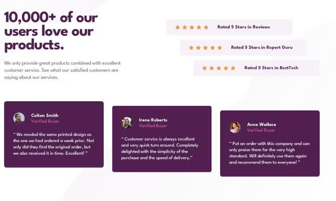

<div align="center">

    
</div>

<div align="center">

</div>

<hr>

<div align="center" style="text-align: center">
 <h1><b>Social Proof Section<b></h1>  
<p>Social Proof Section, Este proyecto es parte del desafío #100daysofprojects promovido por:</p> 

[Frontend-Club](https://www.facebook.com/frontendclubfb)
 
</div>

<div align="center">
  
</div>

<div align="center">
    
</div>

<div align="right">

###### indice
</div>

# ```Indice           ```

* [Indice](#indice)
* [Descripcion](#descripcion)
* [El Desafio](#desafio)
* [Enlaces](#enlaces)
* [Recursos](#recursos)
* [Tecnologias](#tecnologias)
* [Subir Proyecto](#subir-proyecto)
* [Agradecimientos](#agradecimientos)
* [Contacto](#contacto)

<div align="center">
    
</div>

## Descripcion

<p align="justify">
 Nuestra misión será crear un componente orden de pedido, usando HTML y CSS; y lograr que se parezca lo más posible al diseño.</p>

## Desafio

<p align="justify">
 Nuestra misión será crear un componente orden de pedido, usando HTML y CSS; y lograr que se parezca lo más posible al diseño.</p>


### _Los usuarios deberían poder:_
- Ver el diseño óptimo en pantallas grandes(1200px) y pequeñas(375px).

### _Importante:_
- Agregar icono favicon al proyecto.
- Renombrar URL fácil de recordar (ej. profile-card-component).
- Agregar título al proyecto (ej. Social Proof Section - Frontend Club).
- Bonus: Documenta el proyecto con un archivo readme.md

<div align="right">

[Regresar Al Indice](#indice)
</div>

## Enlaces

**Lista de recursos para ayudarte a completar el reto.**

`>>>` : [Clonar proyecto inicial](https://github.com/frontend-club/100daysofprojects)

<br>

**Visualizar diseño original.**

`>>>` : [Opcion 01](https://frontend-club.hashnode.dev/social-proof-section)<br>
`>>>` : [Opcion 02](https://frontend-club.hashnode.dev/?source=top_nav_blog_home)

<div align="right">

[Regresar Al Indice](#indice)
</div>

## Recursos

Comparte los recursos que hayas utilizado para completar este proyecto.

1. [Frontend Club](https://www.facebook.com/frontendclubfb) - Comunidad de desarrollo web
2. [Netlify](https://www.netlify.com/) - Plataforma de alojamiento web
3. [Google Fonts](https://fonts.google.com/) - Fuentes gratuitas

<div align="right">

[Regresar Al Indice](#indice)
</div>

## Tecnologias

1. HTML
2. Estilos CSS
3. Animaciones CSS
4. Responsive

<div align="right">

[Regresar Al Indice](#indice)
</div>

## Subir Proyecto

<div align="center">

[subir proyecto](https://docs.google.com/forms/d/e/1FAIpQLScFcrCiH1UI3nuImB3LNF2cHGvRa6y7NhJ7E6i8FRqcS90FbA/viewform)

</div>
<div align="right">

[Regresar Al Indice](#indice)
</div>

## Agradecimientos

_Nuestro agradecimiento a las fuentes que hacen posible los recursos y nos inspiran a seguir compartiendo conocimiento._
- [W3Schools](https://www.w3schools.com/)
- [UI Design Daily](https://www.uidesigndaily.com/)
- [Frontend Mentor](https://www.frontendmentor.io/)
- [Badges](https://github.com/Naereen/badges/blob/master/README.md)
- [Editor MD](https://pandao.github.io/editor.md/)
**El diseño de este proyecto es propiedad de: Frontend Mentor**
<div align="right">

[Regresar Al Indice](#indice)
</div>

## Contacto

Agrega los medios de contacto para que cualquiera pueda encontrarte y hablar sobre tus siguientes grandes proyectos.

| ```Red Social   ``` | ```Enlace   ``` |
| ------------ | ------------ |
|  [LinkedIn](https://mx.linkedin.com/) |  [Facebook](https://www.facebook.com/)|
|  [GitHub](https://github.com/Sinaptron) |[Correo](https://www.google.com/intl/es/gmail/about/)   |

<div align="right">

[Regresar Al Indice](#indice)
</div>
<div align="center">
    
</div>
